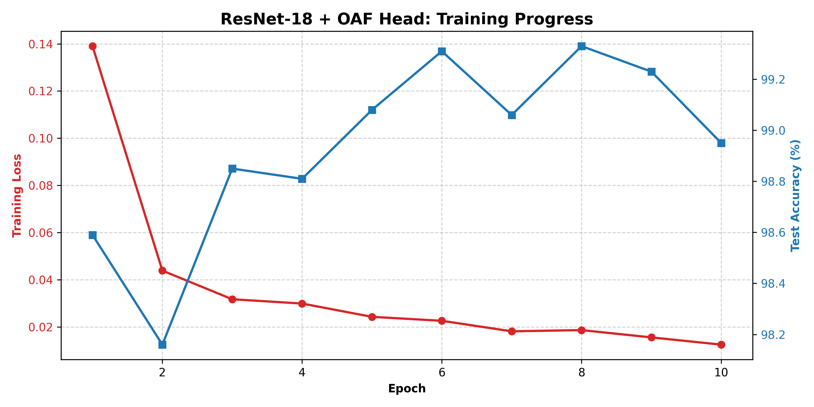
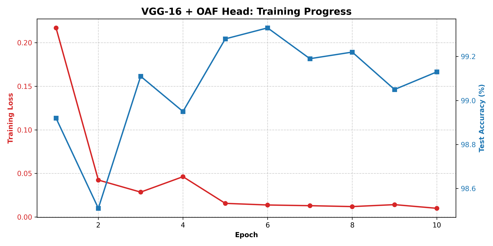

# 🔍 Preventing Vanishing Gradients Using Orthogonal Additive Filters

A research-oriented deep learning project that systematically analyzes and mitigates the vanishing gradient problem in deep neural networks using **Orthogonal Additive Filters (OAF)**, validated through mathematical intuition, NumPy simulations, and PyTorch experiments across MLPs, ResNet-18, and VGG-16 architectures.

---

## 📖 Overview

Training very deep neural networks is historically challenging due to the **vanishing gradient problem**, where error signals shrink as they propagate backward through many layers. This leaves early layers frozen, unable to learn effectively.

This project proposes a structural modification to the fundamental building block of classification heads. By introducing a magnitude-preserving bypass, we give deep networks a "memory boost" using linear algebra, significantly improving gradient flow without requiring complex architectural overhauls (like skip connections).

---

## 🧠 Key Idea: The Math

**Standard deep MLP layer:**
$$h_i = \sigma(W_i h_{i-1})$$
*(Signal decays if weights or activation derivatives are small.)*

**Proposed Orthogonal Additive Layer (OAF):**
$$h_i = \sigma(W_i h_{i-1}) + \mathbf{Q} h_{i-1}$$
*(Signal is perfectly preserved via matrix $\mathbf{Q}$.)*

Where $\mathbf{Q}$ is an **Orthogonal Matrix**. In linear algebra, orthogonal matrices represent a rotation in space, meaning they **preserve vector magnitude**. If a gradient signal enters the layer, it exits with the exact same mathematical strength, preventing it from vanishing.

---

## 🧪 Methodology & Phases

The project was carried out in three escalating stages:

1. **Phase 1: Pure Mathematical Proof (NumPy & PyTorch MLPs)** Proved that standard deep MLPs suffer from vanishing gradients, while OAF-equipped MLPs maintain perfect gradient stability and converge faster.
2. **Phase 2: Modern Architecture Integration (ResNet-18)** Replaced the standard classification head of a modern ResNet-18 with an ultra-deep OAF head to prove that the orthogonal bypass can scale to heavy-duty computer vision models.
3. **Phase 3: The Ultimate Test (VGG-16)** VGG-16 is notoriously fragile and prone to severe vanishing gradients because it lacks ResNet's "skip connections". We attached the deep OAF head to VGG-16 to see if the orthogonal bypass alone could rescue a deep, un-skipped network.

---

## 📊 Results & Visual Validation

### Phase 2: ResNet-18 + OAF Head
The OAF head allowed the optimizer to find the bottom of the loss landscape flawlessly, achieving **~99.2% test accuracy** with zero gradient stalling.

*(Add your ResNet plot here - save your uploaded image as `resnet_training_metrics.png` in a `plots` folder)*


### Phase 3: VGG-16 + OAF Head (The Final Boss)
Despite VGG-16's lack of skip connections and massive 130M+ parameter count, the OAF head completely stabilized the learning process. Loss plummeted smoothly, and the network easily climbed to **~99.2% accuracy**, proving the OAF solves gradient death in historically stubborn architectures.

*(Add your VGG plot here - save your uploaded image as `vgg_training_metrics.png` in a `plots` folder)*


### Summary Table
| Architecture | Classification Head | Gradient Behavior | Peak Accuracy |
|------|------------------|------------|------------|
| Deep MLP | Standard Linear | Vanishing | Slow / Low |
| Deep MLP | Orthogonal Additive | Stable | Fast / High |
| ResNet-18 | Orthogonal Additive | Excellent | ~99.2% |
| VGG-16 | Orthogonal Additive | **Perfect Stability** | **~99.2%** |

---

## 📂 Repository Structure

```text
Vanishing_gradient_Project/
├── numpy_experiments/          # Phase 1: NumPy Mathematical Proofs
├── pytorch_experiments/        # Phase 1: PyTorch MLP Baselines
├── resnet_experiments/         # Phase 2: ResNet-18 Integration
│   ├── train_cifar.py          
│   ├── plot_metrics.py         
│   └── Results/                
├── vgg_experiments/            # Phase 3: VGG-16 Integration
│   ├── train_vgg.py            
│   ├── plot_vgg_metrics.py     
│   └── Results/                
├── plots/                      # Final generated charts
└── README.md
